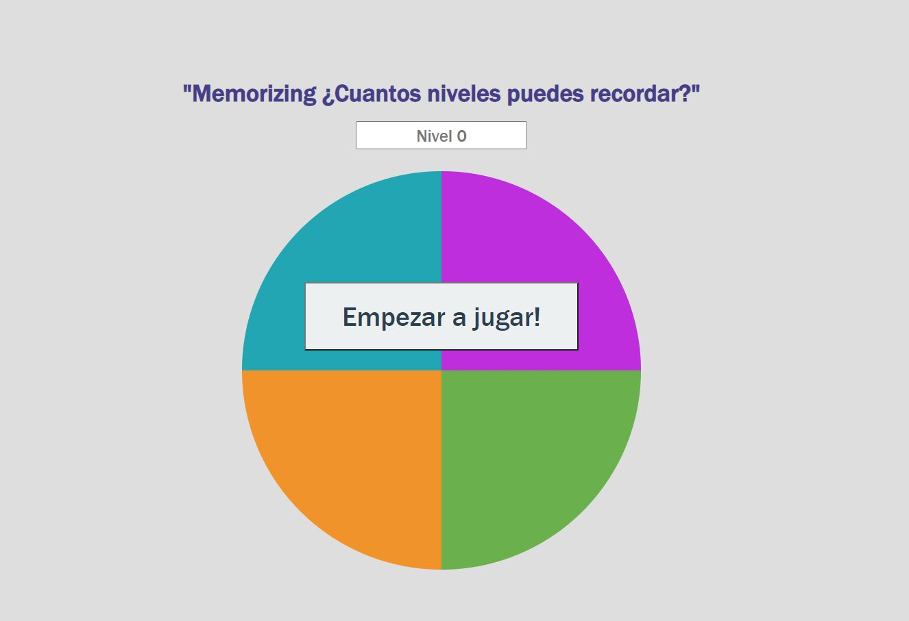

#  🧐 Old Apple page-project

> Video game fully encoded in JS, as part of the PLATZI JavaScript Fundamentals Project.

## 🧐 About Memorizing. How many levels can you remember? 

- Changes from the original project of the course:

	- Code separation in files: HTML, CSS and JS.
	- Creation of 2 more divisions in the html, one for the title and one for the level counter.
	- Counter is updated while you are playing and if the game is restarted.
	
- Concept learned:
	- Declaration of variables in global and local scope.
	- Use of **const** , **let** , and **var** for different applications.
	- Use of conditionals **if**, **switch**.
	- Creation of classes with JavaScript.
	- Use of arrow functions.
	

## 🔧 Built With

- HTML and CSS3.
- Vanilla JavaScript

## 🔴 Live Demo

[Live Demo Link](https://diazgio.github.io/JuegoJs/)

## 🛠 Getting Started

To get a local copy up and running follow these simple example steps.

- Go to the main page of te repo.
- Press the "Code" button and get the repo link.
- Clone it using git.

## 📝 Librarys

- Sweet Alert: [Sweet Alert](https://sweetalert.js.org/)

## ✒️ Authors

👤 **Giordano Díaz**

- Github: [@diazgio](https://github.com/diazgio)
- Twitter: [@giordano_diaz](https://twitter.com/giordano_diaz)
- LinkenIn:[LinkenIn](www.linkedin.com/in/Giordano-Diaz)

## 🤝 Contributing

Contributions, issues and feature requests are welcome!

Feel free to check the [issues page](issues/).

## 📝 License

This project is [MIT](lic.url) licensed.

### End
